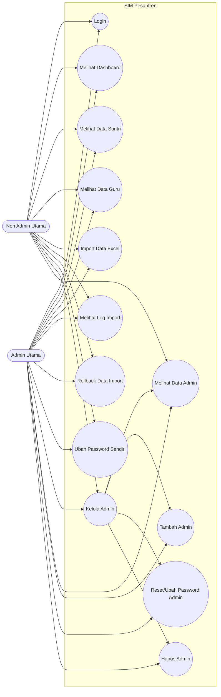

# Use Case Sistem Informasi Manajemen Pesantren

## 1. Aktor

| Aktor | Deskripsi |
| --- | --- |
| Admin Utama | Akun utama sistem dengan username `admin`. Memiliki hak penuh untuk mengelola akun admin lain pada menu Kelola Admin. |
| Non Admin Utama | Akun admin biasa yang dibuat oleh Admin Utama. Dapat menggunakan fitur sistem, tetapi pada menu Kelola Admin hanya dapat melihat data admin. |

## 2. Diagram Use Case

## 3. Matriks Hak Akses

| Modul / Use Case | Admin Utama | Non Admin Utama |
| --- | --- | --- |
| Login | Ya | Ya |
| Melihat Dashboard | Ya | Ya |
| Melihat Data Santri | Ya | Ya |
| Melihat Data Guru | Ya | Ya |
| Import Data Excel | Ya | Ya |
| Melihat Log Import | Ya | Ya |
| Rollback Data Import | Ya | Ya |
| Ubah Password Sendiri | Ya | Ya |
| Melihat Data Admin | Ya | Ya, hanya baca |
| Tambah Admin | Ya | Tidak |
| Reset/Ubah Password Admin Lain | Ya | Tidak |
| Hapus Admin | Ya | Tidak |

## 4. Use Case Login

| Elemen | Keterangan |
| --- | --- |
| Nama Use Case | Login |
| Aktor | Admin Utama, Non Admin Utama |
| Tujuan | Masuk ke sistem agar dapat mengakses fitur SIM Pesantren. |
| Prasyarat | Aktor memiliki akun admin yang terdaftar. |
| Alur Utama | Aktor membuka halaman login, mengisi username dan password atau menggunakan Google Sign-In, lalu sistem memvalidasi akun. Jika valid, sistem menampilkan dashboard. |
| Alur Alternatif | Jika username, password, atau email Google tidak valid, sistem menampilkan pesan gagal login. |
| Hasil Akhir | Aktor berhasil masuk ke sistem. |

## 5. Use Case Kelola Admin

### 5.1 Melihat Data Admin

| Elemen | Keterangan |
| --- | --- |
| Nama Use Case | Melihat Data Admin |
| Aktor | Admin Utama, Non Admin Utama |
| Tujuan | Melihat daftar akun admin yang terdaftar di sistem. |
| Prasyarat | Aktor sudah login. |
| Alur Utama | Aktor membuka menu Kelola Admin, sistem mengambil daftar admin, lalu menampilkan username, email Gmail, status Gmail, terakhir aktif, dan kolom aksi. |
| Aturan Hak Akses | Admin Utama dapat melihat data admin lengkap. Non Admin Utama hanya dapat membaca data admin dan tidak mendapat tombol tambah, reset password, atau hapus. |
| Hasil Akhir | Daftar admin tampil di halaman Kelola Admin. |

### 5.2 Tambah Admin

| Elemen | Keterangan |
| --- | --- |
| Nama Use Case | Tambah Admin |
| Aktor | Admin Utama |
| Tujuan | Membuat akun admin baru agar pengguna lain dapat mengakses sistem sebagai admin. |
| Prasyarat | Aktor sudah login sebagai username `admin`. |
| Alur Utama | Admin Utama membuka Kelola Admin, mengisi username, email Gmail opsional, dan password, lalu menekan Tambahkan Akun. Sistem memvalidasi data dan menyimpan akun baru. |
| Alur Alternatif | Jika username atau email sudah digunakan, sistem menampilkan pesan gagal. Jika username atau password kosong, sistem menolak penyimpanan. |
| Hasil Akhir | Akun admin baru berhasil dibuat. |

### 5.3 Reset/Ubah Password Admin

| Elemen | Keterangan |
| --- | --- |
| Nama Use Case | Reset/Ubah Password Admin |
| Aktor | Admin Utama |
| Tujuan | Mengubah password akun admin lain ketika diperlukan. |
| Prasyarat | Aktor sudah login sebagai username `admin` dan akun target tersedia. |
| Alur Utama | Admin Utama membuka Kelola Admin, memilih tombol Reset Password pada akun target, memasukkan password baru dan konfirmasi, lalu sistem menyimpan password baru. |
| Alur Alternatif | Jika password kurang dari 6 karakter atau konfirmasi tidak cocok, sistem menampilkan pesan gagal. |
| Aturan Hak Akses | Admin Utama tidak mereset password dirinya lewat tombol aksi pada tabel. Non Admin Utama tidak dapat mereset password admin lain dari menu Kelola Admin. |
| Hasil Akhir | Password akun target berhasil diperbarui. |

### 5.4 Hapus Admin

| Elemen | Keterangan |
| --- | --- |
| Nama Use Case | Hapus Admin |
| Aktor | Admin Utama |
| Tujuan | Menghapus akun admin yang sudah tidak digunakan. |
| Prasyarat | Aktor sudah login sebagai username `admin` dan akun target bukan akun dirinya sendiri. |
| Alur Utama | Admin Utama membuka Kelola Admin, memilih tombol Hapus pada akun target, melakukan konfirmasi, lalu sistem menghapus akun tersebut. |
| Alur Alternatif | Jika Admin Utama mencoba menghapus akun sendiri atau akun utama `admin`, sistem menolak penghapusan. |
| Hasil Akhir | Akun admin target berhasil dihapus dari sistem. |

## 6. Use Case Import Data Excel

| Elemen | Keterangan |
| --- | --- |
| Nama Use Case | Import Data Excel |
| Aktor | Admin Utama, Non Admin Utama |
| Tujuan | Menambahkan data santri atau guru ke database melalui file Excel. |
| Prasyarat | Aktor sudah login dan memiliki file Excel dengan format `.xls` atau `.xlsx`. |
| Alur Utama | Aktor mengunggah file, memilih tabel tujuan, melakukan mapping kolom, memvalidasi data, melihat simulasi, lalu menjalankan import. Sistem menyimpan data valid dan membuat log import. |
| Alur Alternatif | Jika format file salah, tabel tujuan tidak valid, mapping kosong, atau data duplikat, sistem menampilkan pesan gagal atau menandai baris sebagai invalid. |
| Hasil Akhir | Data valid masuk ke tabel santri atau guru, sedangkan hasil proses tercatat di log import. |

## 7. Use Case Log Import dan Rollback

| Elemen | Keterangan |
| --- | --- |
| Nama Use Case | Melihat Log Import dan Rollback |
| Aktor | Admin Utama, Non Admin Utama |
| Tujuan | Melihat riwayat import dan mengembalikan data hasil import jika diperlukan. |
| Prasyarat | Aktor sudah login dan terdapat log import. |
| Alur Utama | Aktor membuka Log Import, sistem menampilkan daftar riwayat import beserta jumlah data berhasil dan gagal. Jika diperlukan, aktor memilih rollback pada log tertentu. |
| Alur Alternatif | Jika log sudah pernah di-rollback atau tidak memiliki data terkait, sistem menolak rollback. |
| Hasil Akhir | Riwayat import tampil, dan data hasil import dapat dihapus kembali melalui rollback. |

## 8. Aturan Bisnis Khusus Admin

1. Admin Utama ditentukan dari akun dengan username `admin`.
2. Hanya Admin Utama yang dapat melakukan tambah, reset password admin lain, dan hapus admin pada menu Kelola Admin.
3. Non Admin Utama tetap dapat membuka menu Kelola Admin, tetapi hanya untuk membaca daftar admin.
4. Non Admin Utama tidak melihat form tambah admin dan tidak melihat tombol aksi untuk reset password atau hapus.
5. Akun Admin Utama tidak boleh dihapus agar sistem tidak kehilangan akses pengelolaan utama.
6. Admin tidak dapat menghapus akun yang sedang digunakan oleh dirinya sendiri.
7. Email Gmail pada akun admin digunakan untuk login melalui Google Sign-In.
